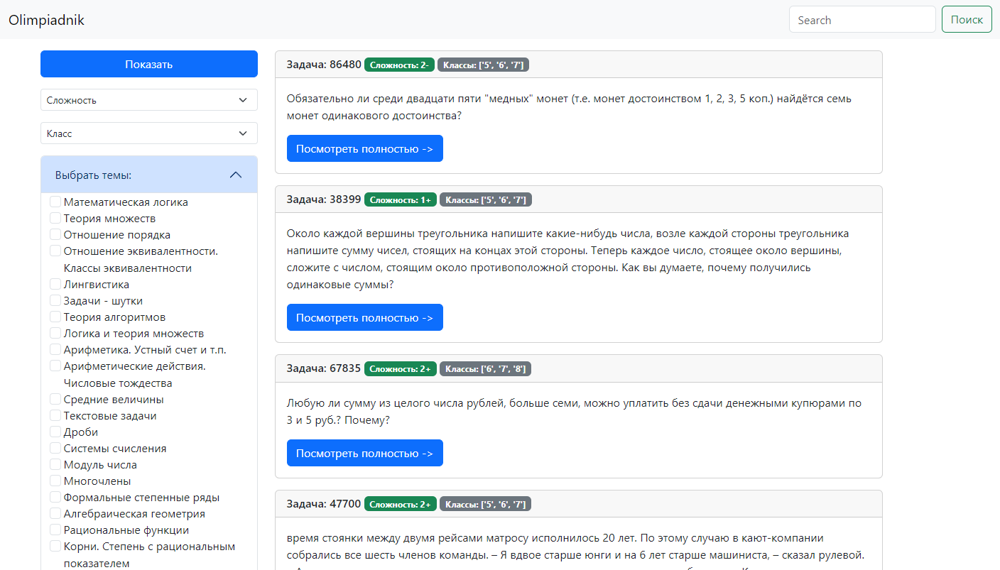
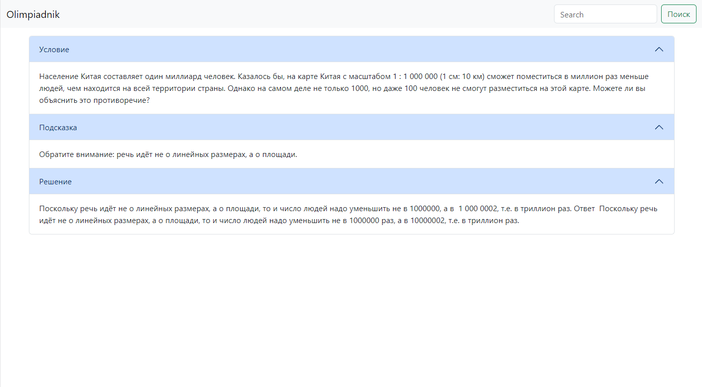
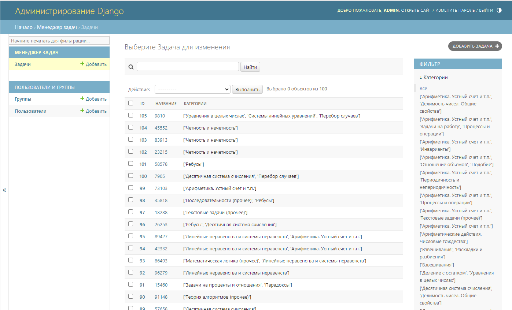

# Olympiadnik.com

## Назначение проекта

**Olympiadnik.com** – веб-приложение (Django-сайт), созданное в качестве школьного проекта. Оно предназначено для хранения и предоставления пользователям задач с олимпиад по математике. Проект позволяет собирать задачи с внешнего источника и удобно искать их на своём сайте.

## Основные возможности

- **Каталог задач с поиском и фильтрацией:** Веб-интерфейс предоставляет список олимпиадных задач, которые можно фильтровать по различным параметрам и искать по ключевым словам.
- **Административная панель:** Реализована админ-панель Django, через которую можно управлять базой данных задач (добавлять, редактировать или удалять задачи, просматривать статистику и т.д.).
- **Локальная база данных задач:** Все задачи хранятся в локальной базе (SQLite), что обеспечивает быстрый доступ и возможность работы офлайн с уже загруженными данными.
- **Парсер задач:** Встроенный парсер автоматически собирает полную информацию о задачах с внешнего сайта (например, с ресурса **problems.ru**) и заносит эти данные в базу. Это позволяет поддерживать актуальность и полноту банка задач.

## Используемые технологии

- **Backend:** Python (фреймворк Django) для реализации серверной логики и веб-интерфейса.
- **База данных:** SQLite3, встроенная СУБД, для хранения задач и связанной информации.
- **Парсинг веб-страниц:** Библиотека `requests` (для HTTP-запросов) и `BeautifulSoup4` (для разбора HTML) используются в модуле парсера задач.
- **Обработка изображений:** Библиотека `Pillow` применяется для работы с изображениями задач (если таковые встречаются).
- **Фронтэнд:** Страницы генерируются Django-шаблонами (HTML), стилизация базовая; пользовательский интерфейс – простой сайт для навигации по задачам.

## Скриншоты





## Структура проекта

```bash
mysite/
├── db.sqlite3 # Файл базы данных SQLite
├── generator/ # Django-приложение для генерации контента
│ ├── admin.py # Настройки административной панели
│ ├── apps.py # Конфигурация приложения
│ ├── init.py
│ ├── migrations/ # Миграции базы данных
│ │ └── init.py
│ ├── models.py # Модели данных приложения
│ ├── tests.py # Модульные тесты
│ └── views.py # Представления (views)
├── manage.py # Основной скрипт управления Django-проектом
├── mysite/ # Основные настройки и конфигурация проекта Django
│ ├── asgi.py # Конфигурация ASGI
│ ├── init.py
│ ├── settings.py # Настройки проекта
│ ├── urls.py # Конфигурация маршрутизации URL
│ └── wsgi.py # Конфигурация WSGI
├── parser.py # Скрипт для парсинга данных
├── task_manager/ # Django-приложение для управления задачами
│ ├── admin.py # Административная панель задач
│ ├── apps.py # Конфигурация приложения управления задачами
│ ├── forms.py # Формы приложения
│ ├── init.py
│ ├── migrations/ # Миграции базы данных задач
│ │ ├── 0001_initial.py
│ │ └── init.py
│ ├── models.py # Модели задач
│ ├── templates/ # Шаблоны HTML для приложения задач
│ │ └── task_manager/
│ │ ├── home_tasks.html
│ │ ├── index.html
│ │ ├── list_themes.html
│ │ ├── task.html
│ │ └── view_task.html
│ ├── tests.py # Тесты приложения задач
│ ├── urls.py # URL-маршруты приложения задач
│ └── views.py # Представления приложения задач
└── templates/ # Общие шаблоны проекта
├── admin/
│ └── base_site.html # Шаблон административной панели
├── base.html # Базовый шаблон сайта
├── inc/
│ ├── _nav.html # Навигация сайта
│ └── _sidebar.html # Боковая панель сайта
└── main.html # Основной шаблон главной страницы
```

## Установка и запуск

1. **Клонирование репозитория:** Скопируйте код проекта на свой компьютер командой:
   ```bash
   git clone https://github.com/MegoM2323/Olympiadnik.com.git
   ```
   Перейдите в директорию проекта:
   ```bash
   cd Olympiadnik.com
   ```
2. **Установка зависимостей:** Убедитесь, что у вас установлен Python 3. Затем установите необходимые библиотеки:
   ```bash
   pip install -r requirements.txt
   ```
3. **Применение миграций (если нужно):** Выполните миграции для настройки базы данных SQLite:
   ```bash
   python mysite/manage.py migrate
   ```
   Это создаст файл `db.sqlite3` с требуемой структурой, если он ещё не создан.
4. **Запуск сервера разработки:** Перейдите в директорию проекта Django (где находится `manage.py`) и запустите встроенный сервер:
   ```bash
   cd mysite
   python manage.py runserver
   ```
   После этого сайт будет доступен локально по адресу `http://127.0.0.1:8000/` в вашем браузере.
5. **Админ-панель:** Чтобы зайти в административную панель Django, откройте `http://127.0.0.1:8000/admin/`. _(При необходимости создайте суперпользователя командой `python manage.py createsuperuser` и задайте ему логин/пароль.)_ В админ-панели вы сможете управлять задачами и другими моделями приложения.

## Лицензия

Лицензия не указана. (По умолчанию, все права на исходный код принадлежат автору проекта.)
